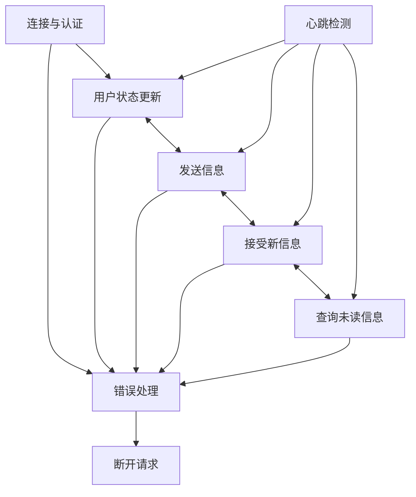
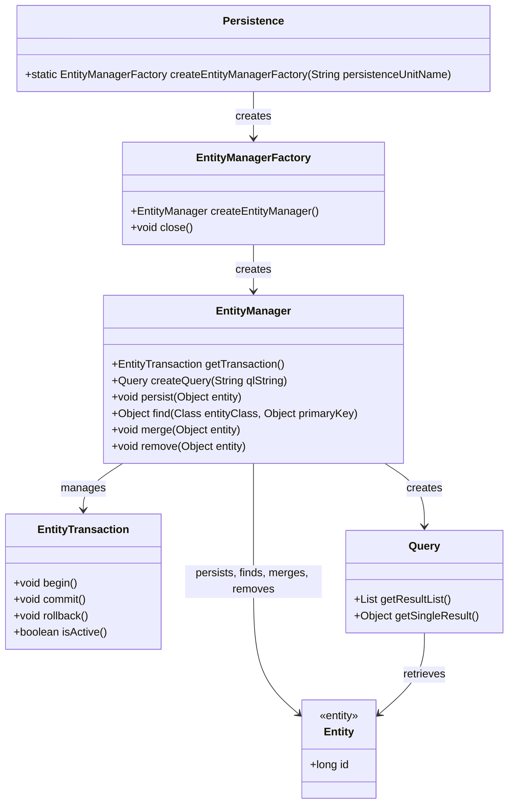

# REST风格API

> [!NOTE]
>
> 虽然简单，但是不适合实时通讯，因为每次都要建立新的连接。这里在注册、登录、获取聊天记录等非实时的操作就使用REST API处理，而使用WebSocket处理实时聊天和信息推送

## 1。用户管理

| 方法 | URL              | 作用         | 请求体                                                       | 响应                                                     |
| ---- | ---------------- | ------------ | ------------------------------------------------------------ | -------------------------------------------------------- |
| POST | `/api/register`  | 注册         | `{"username": "user1", "password": "123456","email":"xxx@qq.com"}` | `{"id": "1", "username": "user1", "token": "JWT_token"}` |
| POST | `api/login`      | 登录         | `{"username": "user1", "password": "123456","email":"xxx@qq.com"}` | `{"id": "1", "username": "user1", "token": "JWT_token"}` |
|      |                  |              |                                                              |                                                          |
| GET  | `api/users/{id}` | 获取用户信息 | `null`                                                       | `{"id": "1", "username": "user1", "status": "online"}`   |

## 2. 会话管理（登录之后需要新建会话）

| 方法 | URL                       | 作用                   | 请求体                     | 响应                                                         |
| ---- | ------------------------- | ---------------------- | -------------------------- | ------------------------------------------------------------ |
| POST | `/api/conversations`      | 创建一个新的会话       | `{"user_ids": ["1", "2"]}` | `{"conversation_id": "123", "user_ids": ["1", "2"]}`         |
| GET  | `/api/conversations`      | 获取用户参与的会话列表 | `null`                     | `[{"conversation_id": "123", "user_ids": ["1", "2"], "last_message": "..."}]` |
| GET  | `/api/conversations/{id}` | 获取指定会话的详细信息 | `null`                     | `{"conversation_id": "123", "messages": [...], "participants": [...]}` |

## ~~3.发送与接收消息~~(不要使用)

| 方法 | URL                                 | 作用                             | 请求体                                                       | 响应                                                         |
| ---- | ----------------------------------- | -------------------------------- | ------------------------------------------------------------ | ------------------------------------------------------------ |
| POST | `/api/conversations/{id}/messages`  | 在会话中发送消息                 | `{"sender_id": "1", "content": "Hello!"}`                    | `{"message_id": "456", "sender_id": "1", "content": "Hello!", "timestamp": "..."}` |
| GET  | ` /api/conversations/{id}/messages` | 获取会话中的消息记录（支持分页） | `?page=1&limit=20` 太简洁，这里直接加参数，不用大费周章搞请求体(消息分页为第一页，前20条) | `[{"message_id": "456", "sender_id": "1", "content": "Hello!", "timestamp": "..."}]` |
|      |                                     |                                  |                                                              |                                                              |

## ~~4. 在线状态管理~~

| 方法 | URL                      | 作用               | 请求体               | 响应                    |
| ---- | ------------------------ | ------------------ | -------------------- | ----------------------- |
| GET  | `/api/users/{id}/status` | 查询用户的在线状态 | `null`               | `{"status": "online"}`  |
| POST | `/api/users/{id}/status` | 更新用户的在线状态 | `{"status": "away"}` | `{"status": "updated"}` |
|      |                          |                    |                      |                         |

## 5. 通知管理

| 方法 | URL                              | 作用                     | 请求体                | 响应 |
| ---- | -------------------------------- | ------------------------ | --------------------- | ---- |
| GET  | `/api/conversations/{id}/unread` | 获取会话中的未读消息数量 | `{"unread_count": 5}` |
|      |                                  |                          |                       |      |
|      |                                  |                          |                       |      |

# WebSocket

## > 客服端与服务端建立双向连接，实时推送；

> [!NOTE]
>
> 使用的时候有专门的WebSocket API套件，将数据对象转换成json格式，接口只是为了统一使用约定

### 1. WebSocket连接

| 方法 | URL Endpoint               | 作用               | 请求体                                  | 响应                                             |
| ---- | -------------------------- | ------------------ | --------------------------------------- | ------------------------------------------------ |
| POST | `wss://example.com/api/ws` | 建立连接，验证身份 | `{"type": "auth","token": "JWT_token"}` | `{"type": "auth_response", "status": "success"}` |
|      |                            |                    |                                         |                                                  |
|      |                            |                    |                                         |                                                  |

### 2. 消息，状态处理

| 类型               | 描述                                                         | 请求体结构（客--->服务端）                                   | 响应（服务端---> 客)                                         |
| ------------------ | ------------------------------------------------------------ | ------------------------------------------------------------ | ------------------------------------------------------------ |
| `send_message`     | 客户端发送消息到指定会话。                                   | {     "type": "send_message",     "data": {         "conversation_id": "123",         "sender_id": "1",         "content": "Hello, this is a message!"     } } | {     "type": "send_message_response",     "status": "success",     "data": {         "message_id": "789",         "timestamp": "2024-10-31T08:01:00Z"     } } |
| `new_message`      | 服务器推送新消息到客户端                                     |                                                              | {     "type": "new_message",     "data": {         "conversation_id": "123",         "message_id": "456",         "sender_id": "1",         "content": "Hello!",         "timestamp": "2024-10-31T08:00:00Z"     } } |
| `update_status`    | 用户状态——客户端请求更新用户的在线状态。                     | {     "type": "update_status",     "data": {         "user_id": "1",         "status": "online"     } } |                                                              |
| `user_status`      | 用户状态——服务器推送用户的状态变化。                         | 注意二者命令需要分开，毕竟自己状态不是给自己看的             | {     "type": "user_status",     "data": {         "user_id": "2",         "status": "offline"     } } |
| `get_unread_count` | 未读消息处理——客户端请求获取未读消息数量。服务器推送未读消息数量的更新。 | {     "type": "get_unread_count",     "data": {         "conversation_id": "123"     } } | {     "type": "unread_count",     "data": {         "conversation_id": "123",         "unread_count": 5     } } |

### 3. 连接管理

| 类型            | 描述                                                     | 请求（客--->服）               | 响应（服---> 客)               |
| --------------- | -------------------------------------------------------- | ------------------------------ | ------------------------------ |
| `ping` / `pong` | 心跳机制——客户端与服务器**定期**发送心跳消息以保持连接。 | {     "type": "ping" } | {     "type": "pong" } |
|                 |                                                          |                                |                                |
|                 |                                                          |                                |                                |

### 4. 错误处理/断开连接

| 类型         | 描述                                           | 请求（客--->服）                                             | 响应（服---> 客)                                             |
| ------------ | ---------------------------------------------- | ------------------------------------------------------------ | ------------------------------------------------------------ |
| `error`      | 在操作失败或遇到错误时，服务器会推送错误消息。 |                                                              | {     "type": "error",     "data": {         "error_code": "403",         "message": "Unauthorized access"     } } |
| `disconnect` | 客户端或服务器请求关闭连接                     | {     "type": "disconnect",     "data": {         "reason": "User initiated"     } } | {     "type": "disconnect",     "data": {         "reason": "User initiated"     } } |

### 工作流程

# 手册wiki

[菜鸟教程json语法](https://www.runoob.com/json/json-syntax.html)，可以简单类比Python字典数据类型

### The WebSocket API (WebSockets) - Web APIs - MDN Web Docs

MDN Web Docs

https://developer.mozilla.org › References › Web APIs

### Using WebSocket to build an interactive web application

Spring

https://spring.io › guides › messaging-stom...

# JPA

### 架构

### ORM组件

对象-关系映射的核心——映射orm.xml

能将数据类型 转换 为关系类型。特性是将一个对象映射或绑定到它在数据库中的数据。映射时，必须考虑数据，数据类型及其自身实体或任何其他表中的实体关系

### CDN（Content Delivery Network）

利用分布式节点技术，在全球部署服务器分发内容，降低访问延迟和提高稳定性，缩短数据传输距离

> [!NOTE]
>
> CDN与镜像服务器的区别
>
> - 镜像服务器是源内容的完整复制
> - CDN是部分内容的缓存，智能程度更好。CND=更智能的镜像+缓存+流量引导

### 系统组成

| 源服务器Origin Server   | 中心节点                                                     |
| ----------------------- | ------------------------------------------------------------ |
| 边缘服务器Edge Server   |                                                              |
| 负载均衡器Load Balancer | 在多个边缘服务器之间均衡分配用请求流量。它根据不同算法（如轮询、最少连接等）将请求导向最优边缘服务器，以实现负载均衡和高可用性 |
| 缓存机制                |                                                              |
| DNS                     | 解析用户请求的域名并将其映射到最近的边缘服务器（访问过程依赖的基础，**重定向** 技术 |
| 内容管理系统            |                                                              |

相同的拓扑结构，图算法在这里能够大显神通

