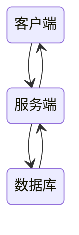

# Java 技术框架
> 有需要就随时编辑

## 1.技术选型

- 后端：Spring Boot
- 前端：先做出一个用Vue框架做的界面，具体仿照QQ群聊，对话，朋友圈空间，视频播放。选用美观的组件库eUI
- 数据库：MySQL，客户端采用SQLite，比较小巧

## 2.系统架构设计

- 客户端：用户界面（借鉴现有一些聊天软件，微信QQ钉钉TG——功能不要多因为要求不能留空白，如果之后想要增加功能的时候再增加，但是项目一定要在完整——且**美观**），消息收发，加密（最贱的异或加密——我们是注重安全的）
- 服务器端：处理客户端请求，管理用户端请求（消息转发，文件下载，注册，注销，其他信息请求），管理用户会话（实时转发，消息撤回），缓存消息记录
- 数据库：储存用户信息、聊天记录；（前端数据储存可以选用SQLite，但是如果是浏览器界面，其实本地会话储存就足够了）



> [!NOTE]
>
> 约定：统一接口，代码风格（方便代码审查）

### 3.实时通讯

- WebSocket：实现实时双向通信，适合聊天应用
  - 后端Java使用```javax.websocket```API
  - 前端使用js的WebSocket API


### 4.用户管理

- 实现用户注册（注销）和登录
- 管理在线用户状态，比如说实现QQ中的在线转态

### 5。消息储存与管理

- 数据表结构
  - 注册用户列表，在线用户列表，信息历史记录列表
- 提供消息的发送、接收、储存和检索功能

### 6.安全性

- 确保通信安全（HTTPS）
- 进行用户身份验证和授权（JWT）

### 7.测试与优化

- 功能测试和性能优化
- 自行体验

### 学习资源

- SpringBoot
- WebSocket
- 数据库设计

---

>[!NOTE]
>
>## 1. 视频推流协议
>
>- **WebRTC**：开源协议，支持点对点（P2P）的视频通话和小规模的多人通话，适合一对一、一对多的实时视频功能。
>
>  **RTMP（实时消息传输协议）**：适用于推流直播场景，例如用于主播将视频流推送到服务器，并转码后给大量观众分发。
>
>  **HLS（HTTP实时流协议）**：适用于延迟容忍度较高的场景，比如直播观看，延迟通常在几秒到十几秒之间。
>
>  推荐组合：
>
>  - **WebRTC**：用于实时视频通话（点对点或小规模多人）。
>  - **RTMP + HLS**：用于主播直播推流和观众直播观看。
>
>### 2. 服务端架构设计
>
>#### 服务选择
>
>- **信令服务器**：用于管理用户连接、呼叫信令、视频房间控制等，WebRTC 必须配合信令服务器。可以基于 WebSocket 或 MQTT 来实现。
>
>- 媒体服务器
>
>  ：处理视频的编码/解码、转码和转发，常用的开源媒体服务器包括：
>
>  - **Kurento**：支持多种视频会议场景、录制和转码。
>  - **Jitsi**：适合一对多或小规模多人视频会议。
>  - **Wowza、Nginx RTMP Module**：如果需要做RTMP推流，可以考虑这些媒体服务器。
>
>- **STUN/TURN 服务器**：用于 NAT 穿透，WebRTC 需要 STUN 和 TURN 服务器协助点对点连接。
>
>#### 服务端流程
>
>- 视频通话流程
>  1. 用户A向用户B发起通话请求，信令服务器通知用户B。
>  2. 用户B接受请求后，双方通过WebRTC连接并在点对点或媒体服务器的支持下开始视频通话。
>- 直播推流流程
>  1. 主播通过 RTMP 将视频流推送到媒体服务器。
>  2. 服务器进行视频流转码，并通过 HLS 协议分发给观众。
>
>### 
>
>### 3. 前端技术
>
>- **HTML5 Video**：在前端显示视频流。
>- **JavaScript**：使用 WebRTC API 或其他库（如 `video.js`）来处理视频流和播放。
>
>### 4. 后端技术
>
>- **Spring Boot**：用于处理直播的后端逻辑，管理用户会话和流状态。
>- **FFmpeg**：处理视频流转码和转发。
>
>### 5. 数据存储与管理
>
>- **数据库**：存储用户信息、直播记录、聊天记录等。
>
>### 6. CDN（内容分发网络）
>
>- 如果需要大规模的用户观看直播，使用 CDN（如 Cloudflare、Akamai）可以提高视频的传输速度和稳定性。
>
>### 7. 安全性
>
>- **身份验证和授权**：确保直播内容安全，防止未授权访问。
>- **加密传输**：使用 HTTPS 和加密的 WebRTC 连接。
>
>### 示例工作流程
>
>1. **用户开始直播**：用户通过前端界面选择“开始直播”。
>2. **推流到服务器**：客户端使用 RTMP 或 WebRTC 将视频流推送到服务器。
>3. **服务器处理流**：媒体服务器接收流，并可能进行转码和分发。
>4. **用户观看直播**：其他用户通过前端界面观看直播流。
>
>### 学习资源
>
>- **WebRTC 文档**：了解如何实现实时视频和音频通信。
>- **FFmpeg 官方文档**：学习如何处理音视频流。
>- **Nginx + RTMP 模块指南**：了解如何搭建流媒体服务器。

---

# 功能需求分析

> [!NOTE]
>
> 先定义功能需求，然后再根据需求定制数据属性。这里就列了一下，可能得主要工作流程，先把基本功能给确定了，不重要的属性先砍掉

### 1. **用户管理（对User的基本属性操作）**

- **注册**：用户提交信息（如用户名、密码、邮箱、手机号等），系统验证信息有效性后**创建新账户**（需要数据库新建User表项）。
- **登录/认证**：用户输入用户名和密码，系统验证身份（如使用JWT或OAuth）。在用户认证成功后分配会话令牌，记录在线状态。
- **在线状态**：在用户登录、登出时更新其在线状态（在线、离线、忙碌等），并通知好友更新状态。

### 2. **联系人管理（主要是对FriendList操作）**

- **添加/删除好友**：用户可以通过搜索其他用户，发送好友请求；请求被接受后形成双向好友关系。
- **黑名单/屏蔽**：用户可以屏蔽指定用户，被屏蔽用户将无法发送消息或查看状态。
- **好友列表（FriendLIst）更新**：实时更新在线好友列表，显示每个好友的在线状态。

### 3. **消息收发（Message对象）**

- **消息发送**：用户选择聊天对象或群组发送消息，消息传到服务端处理，然后分发给接收者。
- **消息接收**：服务端接收到消息后实时推送给接收方（可使用 WebSocket、MQTT 等技术）。
- **消息类型**：支持不同的消息类型（文本、图片、语音、视频、文件等），并在传输前对大文件或媒体文件进行压缩、分片处理。
- **消息状态**：包括发送中、已发送、已接收、已读等，发送后更新消息状态并通知发送方。

### 4. **消息记录与存储(User外键History操作）**

- **消息存储**：将消息存储在数据库中，以便日后查询和显示。对于图片、视频等大文件，可存储在对象存储中，仅记录文件路径。
- **历史记录**：用户可以查看与好友或群组的聊天记录，支持按日期、关键词搜索。
- **消息同步**：当用户在不同设备登录时，需同步消息记录，保持设备间的一致性。

### 5. **群聊（User外键ChatroomList中的Chatroom对象进行操作)**

- **群聊创建与管理**：用户可以创建群聊，并邀请好友加入，指定群主或管理员。
- **群成员管理**：群主和管理员可以管理群成员，设置新成员权限，踢出群成员，解散群聊。
- **群消息广播**：群消息由服务端分发给所有在线群成员，异步通知不在线成员。

### 6. **文件传输**

- **发送文件**：支持文件发送，系统将文件上传到服务器或云存储，生成文件路径并传输给接收方。
- **接收文件**：接收方通过文件路径下载文件；对大文件可以分片传输并合并。
- **多媒体消息**：图片、语音、视频等文件发送前压缩处理，服务器完成转码以适配不同终端。

### ~~7. **消息撤回与删除**~~

- **撤回消息**：发送方在特定时间内撤回已发送消息，服务器更改消息状态并通知接收方（更新UI显示撤回）。
- **删除消息**：用户可以在本地删除消息（不影响接收方）或在服务器删除（管理员权限）。

### 8. **通知与推送**

- **新消息推送（Message-Status）**：用户接收新消息时系统推送通知，尤其是在应用后台运行或不活跃状态。
- **状态更新通知（User-Status)**：好友上线、下线、变更状态时更新好友列表并推送通知。
- **多端同步通知**：支持多设备同步，确保消息和状态在所有设备上保持一致。

### 9. **搜索功能**

- **联系人搜索**：用户可以搜索好友或群成员。
- **消息搜索**：支持按关键字、日期、聊天对象搜索历史消息。
- **群组搜索**：支持按群组名称或关键字搜索加入的群聊。

### ~~10. **安全性**~~

- **加密传输**：所有通信采用 SSL/TLS 加密，保护用户隐私和数据安全。
- **敏感内容过滤**：使用过滤规则检测并屏蔽敏感内容，防止不适当内容传播。
- **多因素认证（MFA）**：增加登录的安全性，通过验证码或双重验证等方式保护用户账户。

### ~~11. **高级功能（可选）**~~

- **语音与视频通话**：提供实时音视频通话功能，使用 WebRTC 或其他技术实现。
- **位置共享**：用户可临时共享位置信息，用于好友间的实时位置共享。
- **消息加密**：支持端到端加密，确保消息内容仅发送方和接收方可见。


# IM数据库设计(还没有视频推流)——数据项名称和格式，相当于是API接口的一部分，使用的时候查这些键值对

> ## 基本聊天

> [!NOTE]
>
> 一个需要注意的问题是MySql中单元项没有数组，字典等容器对象，需要要想实现相关功能，需要新建一个**关联表**。所以之后所说的关联表，其实就是实现相当于**数组**的功能

### 用户表（User）

| 字段名             | 数据类型                     | 描述                                                         |
| ------------------ | ---------------------------- | ------------------------------------------------------------ |
| UserID             | INT, PRIMARY KEY             | 主键，用户ID，唯一                                           |
| FriendList         | INT, FOREIGN KEY             | 外键，好友列表ID，唯一                                       |
| Username           | VARCHAR(50)                  | 用户名                                                       |
| Password           | VARCHAR(255)                 | 密码（哈希值）**注册，登录时会用到**                         |
| Email              | VARCHAR(100)                 | 电子邮箱   **登录时会用到**                                  |
| PhoneNumber        | VARCHAR(15)                  | 手机号                                                       |
| CreateTime         | TIMESTAMP                    | 注册时间                                                     |
| LastLogin          | TIMESTAMP                    | 最后登录时间                                                 |
| Status             | ENUM('在线', '离线', '忙碌') | 在线状态，（**向好友展示信息等等**）非必要，有展示的可以自己加一些属性 |
| ...                | ...                          | 其他字段                                                     |
| FriendShipPolicyID | INT, FOREIGN KEY             | 外键，添加好友策略，具体的自定义。ID唯一（**？？？**）       |
| FriendList         | INT, FOREIGN KEY             | 外键，好友列表                                               |
| FriendGroups       | INT, FOREIGN KEY             | 外键，好有分组列表                                           |

---

### 好友列表（FriendList）_从属于User_

| 字段名             | 数据类型         | 描述             |
| ------------------ | ---------------- | ---------------- |
| FriendListID       | INT, PRIMARY KEY | 主键，好友列表ID |
| UserID             | INT, FOREIGN KEY | 有户ID           |
| FriendID           | INT, FOREIGN KEY | 好友ID           |
| FriendName         | Text             | 好友备注         |
| UserFriendGroupsID | INT, FOREIGN KEY | 好友分组ID       |
|                    |                  |                  |

### 好友群组（FriendGroups）_从属于User_

| 字段名         | 数据类型         | 描述           |
| -------------- | ---------------- | -------------- |
| FriendGroupsID | INT, PRIMARY KEY | 主键，群组ID   |
| UserID         | INT, FOREIGN KEY | 外键，所有者ID |
| FriendID       | INT, FOREIGN KEY | 外键，成员ID   |
|                |                  |                |
|                |                  |                |
|                |                  |                |

### UserFriendGroups关联表

| 字段名             | 数据类型         | 描述   |
| ------------------ | ---------------- | ------ |
| UserFriendGroupsID | INT, PRIMARY KEY |        |
| UserID             | INT, FOREIGN KEY | 所有者 |
| FriendGroupsID     | INT, FOREIGN KEY |        |

---

### 聊天室表（ChatRoom）

| 字段名         | 数据类型             | 描述                                     |
| -------------- | -------------------- | ---------------------------------------- |
| RoomID         | INT, PRIMARY KEY     | 聊天室ID                                 |
| RoomName       | VARCHAR(100)         | 聊天室名称                               |
| ChatType       | ENUM('私聊', '群聊') | 聊天室类型                               |
| CreatorUserID  | INT, FOREIGN KEY     | 群主用户ID                               |
| CreateTime     | TIMESTAMP            | 创建时间                                 |
| UserChatRoomID | INT, FOREIGN KEY     | 外键，聊天室成员列表                     |
| MessageQueueID | INT, FOREIGN KEY     | 外键，聊天列表（**涉及聊天记历史信息**） |
  

### 聊天室成员表（UserChatRoom）

| 字段名         | 数据类型               | 描述              |
| -------------- | ---------------------- | ----------------- |
| UserChatRoomID | INT, PRIMARY KEY       | 用户-聊天室关联ID |
| UserID         | INT, FOREIGN KEY       | 用户ID            |
| Role           | ENUM('管理员', '成员') | 角色              |
| RoomID         | INT, FOREIGN KEY       | 聊天室ID          |

### 消息表（Message）_从属于Chatroom_

| 字段名         | 数据类型                                        | 描述                                 |
| -------------- | ----------------------------------------------- | ------------------------------------ |
| MessageID      | INT, PRIMARY KEY                                | 消息ID，唯一                         |
| SenderUserID   | INT, FOREIGN KEY                                | 发送者用户ID                         |
| ReceiverUserID | INT, FOREIGN KEY                                | 接收者ID                             |
| RoomID         | INT, FOREIGN KEY                                | 聊天室ID（群聊为聊天室ID，私聊为空） |
| Content        | TEXT                                            | 信息内容                             |
| SendTime       | TIMESTAMP                                       | 发送时间                             |
| MessageType    | ENUM('Text', 'Photo', 'Video', 'Emoji', 'File') | 消息类型                             |
| Status         | ENUM('已发送', '已接收', '已读')                | 消息状态                             |
|                |                                                 |                                      |

### 消息-聊天室关联表（MessageQueue）

| 字段名         | 数据类型         | 描述                   |
| -------------- | ---------------- | ---------------------- |
| MessageQueueID | INT, PRIMARY KEY | 主键                   |
| MessageID      | INT, FOREIGN KEY | 外键，消息实体         |
| RoomID         | INT, FOREIGN KEY | 外键，消息从属的聊天室 |


### 消息附件表（MessageAttachments）

| 字段名       | 数据类型                                    | 描述         |
| ------------ | ------------------------------------------- | ------------ |
| AttachmentID | INT, PRIMARY KEY                            | 附件唯一ID   |
| MessageID    | INT, FOREIGN KEY                            | 关联消息ID   |
| FilePath     | VARCHAR(255)                                | 附件文件路径 |
| FileType     | ENUM('Image', 'Video', 'Document', 'Audio') | 附件类型     |

---

## > 视频相关

---

### 视频通话记录表（VideoCall）

| 字段名     | 数据类型                       | 描述                               |
| ---------- | ------------------------------ | ---------------------------------- |
| CallID     | INT, PRIMARY KEY               | 主键，通话ID                       |
| CallerID   | INT, FOREIGN KEY               | 外键，发起通话的用户ID             |
| ReceiverID | INT, FOREIGN KEY               | 外键，接收通话的用户ID             |
| StartTime  | TIMESTAMP                      | 通话开始时间                       |
| EndTime    | TIMESTAMP                      | 通话结束时间                       |
| Status     | ENUM('已接通、未接通、已挂断') | 通话状态（已接通、未接通、已挂断） |

#### 直播间表（LiveRoom）

| 字段名     | 数据类型                 | 描述                       |
| ---------- | ------------------------ | -------------------------- |
| RoomID     | INT, PRIMARY KEY         | 主键，直播间ID             |
| HostUserID | INT, FOREIGN KEY         | 外键，主播用户ID           |
| RoomName   | TEXT                     | 直播间名称                 |
| CreateTime | TIMESTAMP                | 直播间创建时间             |
| Status     | ENUM(‘进行中’、‘已结束’) | 直播状态（进行中、已结束） |

#### 观众直播记录表（LiveAudience）

| 字段名     | 数据类型         | 描述             |
| ---------- | ---------------- | ---------------- |
| AudienceID | INT, PRIMARY KEY | 主键，观众记录ID |
| RoomID     | NT, FOREIGN KEY  | 外键，直播间ID   |
| UserID     | NT, FOREIGN KEY  | 外键，观众用户ID |
| JoinTime   | TIMESTAMP        | 加入时间         |
| LeaveTime  | TIMESTAMP        | 离开时间         |


> 是否需要画个ER图？


### ER图元素补全说明

1. **User 与 ChatRoom 表**之间通过 **UserChatRoom** 表形成 **多对多** 关系。
2. **User** 表和 **Message** 表形成 **一对多** 关系，每个用户可以发送多个消息。
3. **ChatRoom** 和 **Message** 表也形成 **一对多** 关系，单聊和群聊信息分别存储 RoomID 或 ReceiverUserID。
4. **Message** 和 **MessageAttachments** 表形成 **一对多** 关系，一个消息可以有多个附件。


## 设计考虑

### 1。性能

- 索引：在关键字段建立索引加快查询速度
- 分表：对于高频消息表，按时间或聊天进行分表

2.安全性

- 密码哈希

---

> [!NOTE]
>
> 其实具体的指令建议告诉AI具体的数据格式，让它来写指令；要学的内容太多，现学现用。[指令手册](https://blog.csdn.net/weixin_61370021/article/details/130797638)

## 1.创建数据库

#### 用户表（Users）

```sql
sqlCopy codeCREATE TABLE Users (
    UserID INT AUTO_INCREMENT PRIMARY KEY, #
    Username VARCHAR(50) NOT NULL UNIQUE,
    PasswordHash VARCHAR(255) NOT NULL,
    CreatedAt TIMESTAMP DEFAULT CURRENT_TIMESTAMP,
    LastLogin TIMESTAMP DEFAULT CURRENT_TIMESTAMP ON UPDATE CURRENT_TIMESTAMP,
    Status ENUM('在线', '离线', '忙碌') DEFAULT '离线'
);
```

#### 聊天表（Chats）

```sql
sqlCopy codeCREATE TABLE Chats (
    ChatID INT AUTO_INCREMENT PRIMARY KEY,
    ChatType ENUM('单聊', '群聊') NOT NULL,
    CreatedAt TIMESTAMP DEFAULT CURRENT_TIMESTAMP
);
```

#### 聊天成员表（ChatMembers）

```sql
sqlCopy codeCREATE TABLE ChatMembers (
    ChatID INT,
    UserID INT,
    Role ENUM('管理员', '成员') DEFAULT '成员',
    PRIMARY KEY (ChatID, UserID),
    FOREIGN KEY (ChatID) REFERENCES Chats(ChatID),
    FOREIGN KEY (UserID) REFERENCES Users(UserID)
);
```

#### 消息表（Messages）

```sql
sqlCopy codeCREATE TABLE Messages (
    MessageID INT AUTO_INCREMENT PRIMARY KEY,
    ChatID INT,
    UserID INT,
    Content TEXT NOT NULL,
    Timestamp TIMESTAMP DEFAULT CURRENT_TIMESTAMP,
    MessageType ENUM('文本', '图片', '视频') DEFAULT '文本',
    Status ENUM('已发送', '已接收', '已读') DEFAULT '已发送',
    FOREIGN KEY (ChatID) REFERENCES Chats(ChatID),
    FOREIGN KEY (UserID) REFERENCES Users(UserID)
);
```

---

## 2.数据库查询指令

### 1. 获取聊天记录

**查询某个聊天的最新50条消息**:

```sql
sqlCopy codeSELECT * FROM Messages 
WHERE ChatID = ? 
ORDER BY Timestamp DESC 
LIMIT 50;
```

### 2. 获取用户的所有聊天

**查询某个用户参与的所有聊天**:

```sql
sqlCopy codeSELECT Chats.* FROM Chats 
JOIN ChatMembers ON Chats.ChatID = ChatMembers.ChatID 
WHERE ChatMembers.UserID = ?;
```

### 3. 获取某个用户的消息记录

**查询某个用户在特定聊天中的消息**:

```sql
sqlCopy codeSELECT * FROM Messages 
WHERE ChatID = ? AND UserID = ? 
ORDER BY Timestamp DESC;
```

### 4. 获取用户信息

**查询用户信息**:

```sql
sqlCopy codeSELECT * FROM Users 
WHERE UserID = ?;
```

### 5. 插入新用户

**注册新用户**:

```sql
sqlCopy codeINSERT INTO Users (Username, PasswordHash, CreatedAt) 
VALUES (?, ?, NOW());
```

### 6. 创建新聊天

**创建新聊天**:

```sql
sqlCopy codeINSERT INTO Chats (ChatType, CreatedAt) 
VALUES (?, NOW());
```

### 7. 添加成员到聊天

**将用户添加到聊天中**:

```sql
sqlCopy codeINSERT INTO ChatMembers (ChatID, UserID, Role) 
VALUES (?, ?, ?);
```

### 8. 发送新消息

**插入新消息**:

```sql
sqlCopy codeINSERT INTO Messages (ChatID, UserID, Content, Timestamp, MessageType, Status) 
VALUES (?, ?, ?, NOW(), ?, ?);
```

### 9. 获取群聊成员

**查询某个群聊的所有成员**:

```sql
sqlCopy codeSELECT Users.* FROM Users 
JOIN ChatMembers ON Users.UserID = ChatMembers.UserID 
WHERE ChatMembers.ChatID = ?;
```

### 10. 获取未读消息

**查询某个用户在特定聊天中的未读消息**:

```sql
sqlCopy codeSELECT * FROM Messages #表示在Message中查询
WHERE ChatID = ? AND Status = '未读';#匹配选项是UserID和Status，如果找到，则返回查找结果
```

---

## 3. Java代码示例

#### 用户注册

```sql
javaCopy codepublic void registerUser(String username, String password) {
    String hashedPassword = hashPassword(password); // 使用适当的哈希函数
    String sql = "INSERT INTO Users (Username, PasswordHash) VALUES (?, ?)";
    
    try (Connection conn = getConnection(); 
         PreparedStatement pstmt = conn.prepareStatement(sql)) {
        pstmt.setString(1, username);
        pstmt.setString(2, hashedPassword);
        pstmt.executeUpdate();
    } catch (SQLException e) {
        e.printStackTrace();
    }
}
```

### 3. 实现用户登录功能

#### Java 代码示例

```sql
javaCopy codepublic boolean loginUser(String username, String password) {
    String sql = "SELECT PasswordHash FROM Users WHERE Username = ?";
    
    try (Connection conn = getConnection(); 
         PreparedStatement pstmt = conn.prepareStatement(sql)) {
        pstmt.setString(1, username);
        ResultSet rs = pstmt.executeQuery();
        
        if (rs.next()) {
            String storedHash = rs.getString("PasswordHash");
            return verifyPassword(password, storedHash); // 使用适当的密码验证方法
        }
    } catch (SQLException e) {
        e.printStackTrace();
    }
    return false;
}
```

### 4. 实现发送消息功能

#### Java 代码示例

```sql
javaCopy codepublic void sendMessage(int chatID, int userID, String content) {
    String sql = "INSERT INTO Messages (ChatID, UserID, Content) VALUES (?, ?, ?)";
    
    try (Connection conn = getConnection(); 
         PreparedStatement pstmt = conn.prepareStatement(sql)) {
        pstmt.setInt(1, chatID);
        pstmt.setInt(2, userID);
        pstmt.setString(3, content);
        pstmt.executeUpdate();
    } catch (SQLException e) {
        e.printStackTrace();
    }
}
```

### 5. 实现撤回消息功能

#### Java 代码示例

```sql
javaCopy codepublic void recallMessage(int messageID) {
    String sql = "UPDATE Messages SET Status = '已撤回' WHERE MessageID = ?";
    
    try (Connection conn = getConnection(); 
         PreparedStatement pstmt = conn.prepareStatement(sql)) {
        pstmt.setInt(1, messageID);
        pstmt.executeUpdate();
    } catch (SQLException e) {
        e.printStackTrace();
    }
}
```

### 6. 数据库连接方法示例

```sql
javaCopy codeprivate Connection getConnection() throws SQLException {
    String url = "jdbc:mysql://localhost:3306/your_database";
    String user = "your_username";
    String password = "your_password";
    return DriverManager.getConnection(url, user, password);
}
```

---

## 需求分析（自顶向下，组层分解）

理解系统工作原理

考虑系统今后拓展

数据字典（data dictionary）=数据项、数据结构、数据流、数据储存、和处理

## 概念结构设计（自底向上）

抽象成模型

## 逻辑结构设计（E-R图）

## 物理设计

MySQL已经解决，B+树索引，聚族方法（Clustering），hash方法


该把这个模型简化一下。

[git协作流程](https://zhuanlan.zhihu.com/p/23478654)


